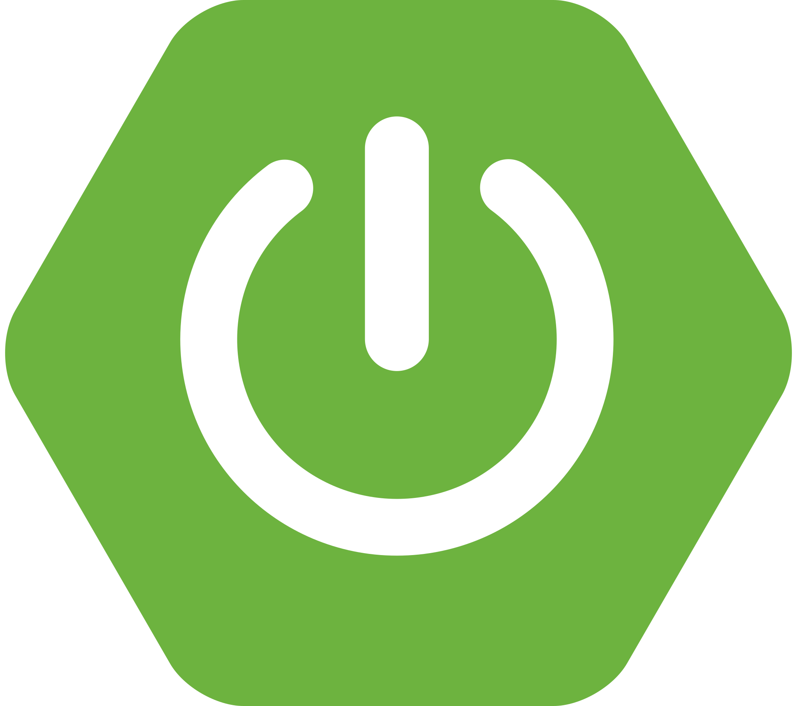

    

# About Me

### I am a Computer Engineer with experience as a Backend Developer using Java and Spring Boot. I enjoy building robust, scalable, and maintainable software solutions, collaborating on projects, and continuously learning new technologies that contribute to the evolution of the tech industry.

- 💼 I have experience in **Backend Development** with **Java** and **Spring Boot**.
- 🌱 My future focus is on **Data Science**, with a strong interest in **Machine Learning** and **Deep Learning**.
- 📫 You can reach me via email: [jb30085@gmail.com](mailto:jb30085@gmail.com)

# Connect with me:

    
    &nbsp;&nbsp;&nbsp;&nbsp;&nbsp;&nbsp;&nbsp;&nbsp;&nbsp;&nbsp;
    
    &nbsp;&nbsp;&nbsp;&nbsp;&nbsp;&nbsp;&nbsp;&nbsp;&nbsp;&nbsp; 
    
    &nbsp;&nbsp;&nbsp;&nbsp;&nbsp;&nbsp;&nbsp;&nbsp;&nbsp;&nbsp; 
    

---

# 🛠️ Technologies & Tools

Here are some of the technologies and tools I use:

<table align="center">
    <tr>
        <td align="center" width="128">
            
             C++
        </td>
        <td align="center" width="128">
            
             C#
        </td>
        <td align="center" width="128">
            
             JavaScript
        </td>
        <td align="center" width="128">
            
             TypeScript
        </td>
        <td align="center" width="128">
            
             Spring Boot
        </td>
        <td align="center" width="128">
            
             Node.js
        </td>
    </tr>
    <tr>
        <td align="center" width="128">
            
             Python
        </td>
        <td align="center" width="128">
            
             AWS
        </td>
        <td align="center" width="128">
            
             Java
        </td>
        <td align="center" width="128">
            
             Git
        </td>
        <td align="center" width="128">
            
             GitHub
        </td>
        <td align="center" width="128">
            
             MySQL
        </td>
    </tr>
    <tr>
        <td align="center" width="128">
            
             PostgreSQL
        </td>
        <td align="center" width="128">
            
             Bootstrap
        </td>
        <td align="center" width="128">
            
             React
        </td>
        <td align="center" width="128">
            
             Docker
        </td>
        <td align="center" width="128">
            
             REST API
        </td>
        <td align="center" width="128">
            
             VS Code
        </td>
    </tr>
    <tr>
        <td align="center" width="128">
            
             CSS
        </td>
        <td align="center" width="128">
            
             HTML
        </td>
    </tr>
</table>

---

# 📈 GitHub Stats

  

    

  

    

  
  

    

  

---

# 🚀 Projects

- **Machine Learning and Data Science (Research)**: Currently, I'm exploring the fields of **Machine Learning** and **Data Science**, with a specific interest in **Deep Learning**. My research focuses on understanding the core principles and applications of these areas.

- **Java & Spring Boot Projects**: I am working with **Java** and **Spring Boot** to build robust, scalable web applications. 

- **React & AWS Projects**: Using **React** to build dynamic and responsive frontend applications, and **AWS** for cloud solutions and deployments.

Feel free to explore and collaborate!

---

# 📚 Stats & Contributions

- 💻 **Backend Development:** Experience building backend solutions with **Java**, **Spring Boot**, REST APIs, and relational databases.
- 🧠 **Learning Path:** Currently focusing on strengthening my knowledge in **Data Science**, **Machine Learning**, and **Deep Learning**.
- 🚀 **Professional Goal:** To combine software engineering and data-driven solutions to build impactful technology products.

Thanks for visiting my profile! Feel free to reach out, and let's collaborate!
